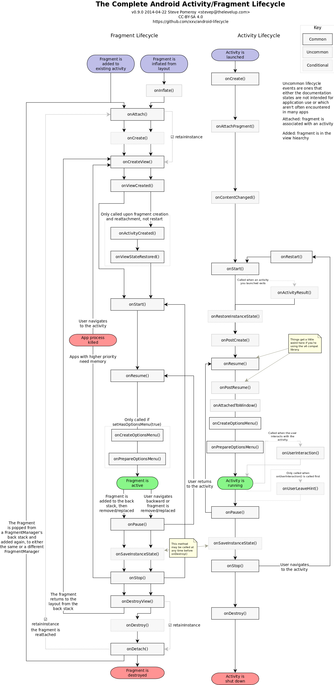

Complete Android Fragment & Activity Lifecycle
----------------------------------------------

After struggling with trying to figure out how various pieces fit together,
I've done some research and put together the complete Android Activity/Fragment
lifecycle chart. This has two parallel lifecycles (activities and fragments)
which are organized vertically by time. Lifecycle stages will occur in the
vertical order in which they're displayed, across activities and fragments. In
this way, you can see how your fragments interact with your activities.

If you see any discrepancies or errors in this diagram, please submit a pull
request or contact [steve@staticfree.info](mailto:steve@staticfree.info).

Vector versions suitable for printing: [PDF][] or [SVG][]

### Some Notes

This intentionally leaves off user-triggered callbacks (such as
`onOptionsItemSelected()`), focusing on the lifecycle stages that are triggered
by the system, in order to keep the diagram more focused on the parts that are
hard to follow.

The canonical format of the diagram is the [Dia][] file. It was then exported
to SVG, hand-tweaked to fix font sizes, and imported into [Inkscape][] to do an
SVG, PDF, and PNG render. I hope to find a better workflow for this going forward;
patches always welcome.

### License

This diagram (in all its various forms and renders) is licensed under the
[Creative Commons BY-SA 4.0 license][CC-BY-SA]. If you would like it under a
different Creative Commons license, please contact me and we can figure
something out.

[Dia]: http://dia-installer.de/
[Inkscape]: http://inkscape.org/
[PDF]: complete_android_fragment_lifecycle.pdf
[SVG]: complete_android_fragment_lifecycle.svg
[CC-BY-SA]: https://creativecommons.org/licenses/by-sa/4.0/
